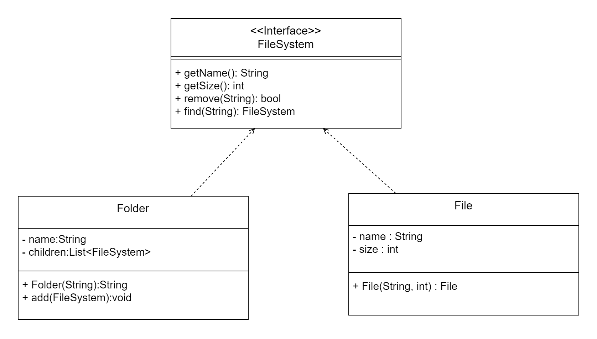

# 컴포지드 패턴

## 특징
- 여러 객체를 가진 복합 객체와 단일 객체를 구분 없이 다루고자 할 때 사용한다
- 객체들을 트리구조를 이용하여 복합 객체 안에 객체와 같은 식으로 활용 할 수 있다.


## 예제 설명


Folder와 File은  FileSystem의 구현체이다. 이렇게 구성한 이유는 다양한 형태의 복합 객체를 
다형성을 활용해서 트리구조로 활용하기 위해서이다.
<br>
자세히 보면 Folder에 리스트 형태의 인스턴스 변수가 있는데 이 변수를 통해서 트리구조로 짤 수 있다.
<br>
이 프로젝트 예제에선 Folder는 노드, File은 잎으로 생각 하면 쉬울 것 같다.


```java
@Override
public int getSize() {
        int total = 0;
        // 재귀 탐색
        for (FileSystem file : children) {
        total += file.getSize(); 
        }
//        System.out.println(String.format("%s 폴더 크기 : %d", this.name, total));
//        System.out.println("----------------");
        return total;
        }
```
재귀 형태로 트리구조를 활용한다.